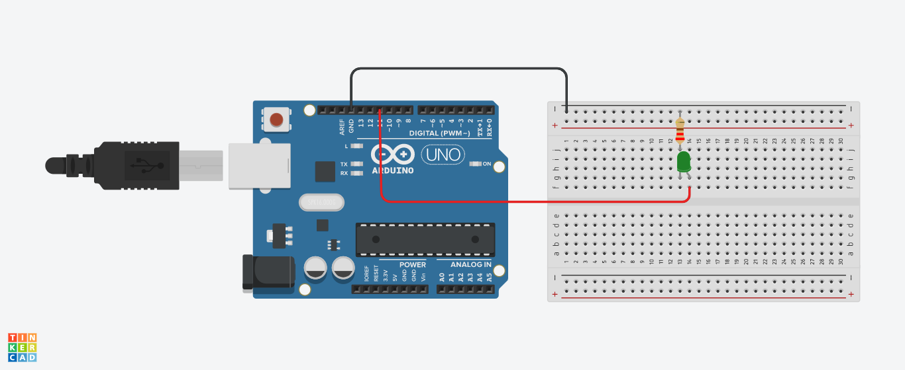

# Arduino serial communication with Python
Recently I've been working on a project and I thought: "Why not connect Arduino and my python code?".
So, I searched over the internet, but I couldn't find anything that really helped me.

I really hope that this post could help you in your projects.

Disclaimer: This is my first post on Github. I'm still learning how to use this thing. If you have some comment or some tip to immprove the conttend, please let me know :+1:.

## First Steps 
1. First off all, you need to assemble the circuit (make sure that you did the right connections);
2. Now, upload the .ino file into your Arduino;
3. After this, open your Python IDE and run the .py file.

## Circuit 
###### Required components: 
- 1 Led 
- 1 Resistor (220 Ohms)

  

